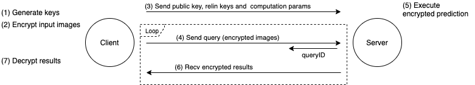
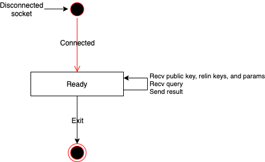

# PP-CNN
Privacy Preserving CNN Inference over Homomorphic Encryption

## Requirement
- GCC (7.4.0)
- CMake (>=3.15)
- [SEAL (3.4.4)](https://github.com/microsoft/SEAL/tree/3.4.4)
- Boost (Use `boost::multi_array` & `boost::program_options`)
- HDF5
  - Require zlib & szip

[Build and run using Docker]
- Docker (19.03.13) 

[Model training] (Python)
- Keras(2.0.8)
- tensorflow-gpu(1.4.0)

## Dataset
- MNIST (http://yann.lecun.com/exdb/mnist/)
- CIFAR-10 (https://www.cs.toronto.edu/~kriz/cifar.html)

## Build
You can build by executing the following commands:

[using Docker]
```
$ bash build_docker.sh
```

[manualy]
```
$ git submodule update -i
$ mkdir build && cd build
$ cmake ..
$ make
```

following files generated.

| File | Content |
|:---|:---|
| `build/ppcnn/ppcnn_client/libppcnn_client.so` | Client library |
| `build/ppcnn/ppcnn_server/libppcnn_server.so` | Server library |
| `build/ppcnn/ppcnn_share/libppcnn_share.so` | Shared library |
| `build/stdsc/stdsc/libstdsc.so` | stdsc library (see: stdsc/README.md) |
| `demo/client/client` | Client demo app |
| `demo/server/server` | Server demo app |


## Run

[using Docker]

1. Start docker container
```
$ bash run_container.sh start
```
2. Allow to make connections to the X server from docker
```
$ xhost local:
```
3. Run demo app on docker
```
$ docker exec -it pp-cnn bash
[root@xxxxxxxx PP-CNN]# bash demo.sh
```
4. Stop docker container
```
$ bash run_container.sh stop
```


[manually]
```
$ bash demo.sh
```

## Demo App
The demo app consists of two processes: Client and Server. These processes communicate as shown in the following figure.



### Client demo app
* Behavior
    * Client generates encryption keys (public key, secret key, relin keys) . (Fig: (1))
    * Client encrypts input images using the public key. (Fig: (2))
    * Client sends public key, relin keys and computation parameters to Server. (Fig: (3))
    * Client sends a query containing the encryped images to Server. (Fig: (4))
    * Client receives encryped results and decrypt it using secret key. (Fig: (6)(7))
* Usage
    ```sh
    Usage: ./client [-D dataset] [-M model] [-O optimize] [-A activation] [-C config]
    ```
    * dataset: Dataset name  (mnist|cifar-10)
    * model: Trained model name
    * optimize: Optimization level (0: no opt, 1: fusing Convolution & Batch Normalization, 2: reduction level of polynomial activation function, 3: reduction level of average pooling, 4: all 1 & 2 & 3 opts)
    * activation: Activation function number (0: default, 1: square, 2: swish_rg4_deg4, 3: swish_rg6_deg4, 4: mish_rg4_deg4, 5: mish_rg6_deg4)
    * config: config filepath
* Configuration
    * Specify the following encryption parameters in the configuration file.
        ```
	power = 15   (Default: 15)
	level = 5    (Default: 5)
        ```
        * power: power of polynomial modulus degree (ex. 13, 14, 15)
        * level: required multiplicative level

### Server demo app
* Behavior
    * Server receives public key, relin keys and computation parameters from Client. (Fig: (3))
    * Server receives a query from Client, then begin the computation and returns the queryID. (Fig: (4))
    * Server returns encryped results. (Fig: (6))
* Usage
    ```sh
    Usage: ./server [-P port] [-Q max_queries] [-R max_results] [-L max_result_lifetime_sec]
    ```
    * port : port number (default: 10001)
    * max_queries : max concurrent queries (default: 128)
    * max_results : max resutls (default: 128)
    * max_result_lifetime_sec : max result lifetime sec (default: 50000)
* State Transition Diagram
    * 

## Train model
Model training code (Python) is in `plaintext_experiment/`

ex) MNIST dataset
```
$ cd plaintext_experiment/mnist
$ python HCNN.py --da
```

# Documents

## API Reference
```
$ cd doc && doxygen
```
see `doc/html/index.html`

# License
Copyright 2020 Yamana Laboratory, Waseda University
Supported by JST CREST Grant Number JPMJCR1503, Japan.

Licensed under the Apache License, Version 2.0 (the "License");
you may not use this file except in compliance with the License.
You may obtain a copy of the License at

http://www.apache.org/licenses/LICENSE-2.0

Unless required by applicable law or agreed to in writing, software
distributed under the License is distributed on an "AS IS" BASIS,
WITHOUT WARRANTIES OR CONDITIONS OF ANY KIND, either express or implied.
See the License for the specific language governing permissions and
limitations under the License.
